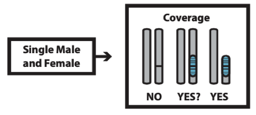

===============================
Step 1. Coverage-based analysis
===============================

To determine if there are large sex-specific regions present in your species of interest, a coverage-based analysis is first carried out.

Running DifCover
----------------

``DifCover`` (https://github.com/timnat/DifCover) requires only a single male and single female ``bam`` file aligned to a reference genome.

Example ``DifCover`` command with 1 male (``SRR8585998_1.fastq.bam``) versus 1 female (``SRR8585999_1.fastq.bam``).

.. code-block:: console

    bash run_difcover.sh SRR8585998_1.fastq.bam SRR8585999_1.fastq.bam 1 >> difCov_Male98_over_Female99_outerr.txt 2>&1

Note that you will need to modify ``run_difcover.sh`` to have a proper path for ``FOLDER_PATH`` on your system, and the ``1`` is the library-specific Adjustment Coefficient (``AC``) to account for differences in sequencing depth between samples. The correct ``AC`` value can be determined by taking the ratio of modal depths for the samples of interest through ``samtools stats`` as follows:

 .. code-block:: console

    chmod u+rwx samtools_Modaldepth.sh
    for file in $(ls *q.bam); do ./samtools_Modaldepth.sh $file; done

Once you have a modal depth for each sample you are interested in, ``AC`` is (modal coverage of sample 2 / modal coverage of sample 1). Of note, I have found that although this works well for some samples, others report a modal depth of 1, which is not helpful for determining ``AC``. In these cases, I have have mixed success simply using the ratio of the ``bam`` file sizes for ``AC``. This can be dialed in after the analysis as well by plotting and examining the center of the distribution (which should lie at 0 for autosomes if ``AC`` is properly set).

Analyzing DifCover Results
--------------------------

An example output file ``sample1_sample2.ratio_per_w_CC0_a10_A219_b10_B240_v1000_l500.log2adj_1.DNAcopyout`` is included in the GitHub repository alongside the ``R`` script ``Fugu_M98_F99_DifCover.R`` used to generate the figures in the main body of the paper. Given that fugu has only a single SNP that is fixed between males and females, coverage does not produce any outlier windows for this species.

As an example of a species that does exhibit significant differences in depth, the ``DifCover`` plot for chicken is also provided below. The code for chicken can be found in ``Supplemental Code`` on GitHub.

*Figure 2. DifCover fails (top) to identify coverage differences between a single male and single female in the fugu, indicating that there are no large regions of recombination suppression in the fugu genome (and/or suggesting that the fugu sex determining region is very young in evolutionary time). DifCover succeeds (bottom) at identify the Z and W chromosomes in chicken using only information on depth of coverage between a single male and single female*
