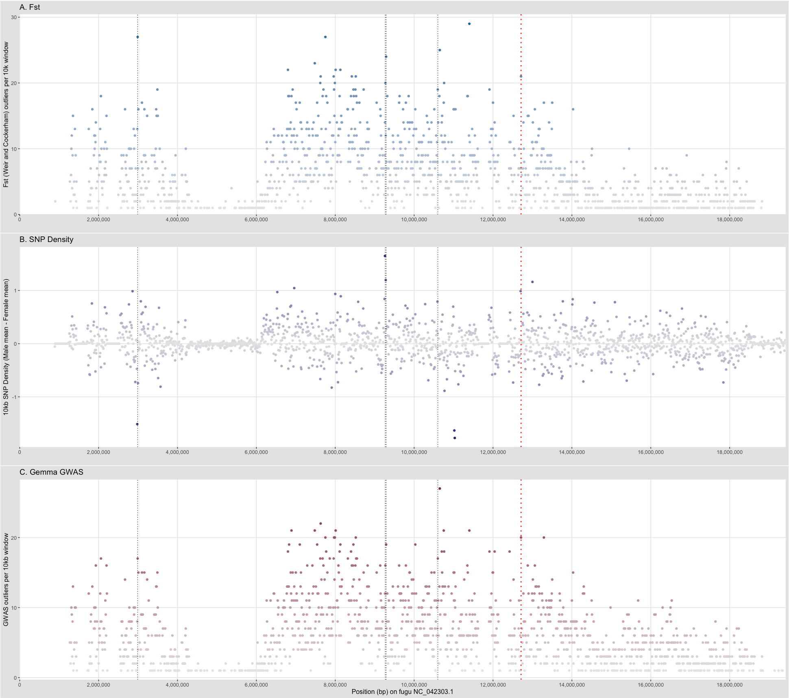

========================================
Step 3. Combined sequence-based analysis
========================================

If you have not been able to identify a consistent signal within your genomic data using Steps 1 and 2, the scripts for Step 3, Combined sequence-based analysis, might be able to help.

In Step 3, non-overlapping signals from the reference-based methods are converted to 10kb windows and combined to increase the user’s power to focus on specific genomic regions. Once candidate windows are identified in Step 3, the user can return to GWAS, SNP density, and ``Fst`` results to determine if fixed or nearly-fixed differences exist between the sexes in the top candidate windows.

Once again, the example code ``Fugu_SexFindR.R`` and necessary input files are included in the GitHub repository in order to run the analysis for fugu and generate the plot in the SexFindR figure in the manuscript.

For the GWAS and ``Fst`` input data, parsing of the input data is carried out both in the ``R`` script, and through ``Python`` scripts and bash commands.

To generate ``gemma_window_count.txt`` which is required for the ``R`` script from ``fugu_gemma_sort_cut.txt`` (which is created in the ``R`` script from ``test_gemma_out.assoc.txt.zip``), do the following on the command line:

.. code-block:: console

    sort -k1,1 -k2n fugu_gemma_sort_cut.txt > coordinated_sorted_gemma_cut.txt
    python window_count.py coordinated_sorted_gemma_cut.txt gemma_window_count.txt 10000

This creates a window-based count of top GWAS hits (top 5%) within each 10 kb region across the genome.

Similarly, to generate ``Fstugu_window_count.txt`` from ``Fstugu_sort_cut.txt`` (created in ``R`` from ``biallelic_fst.weir.fst.zip``),

.. code-block:: console

    sort -k1,1 -k2n Fstugu_sort_cut.txt > coordinated_sorted_Fstugu_cut.txt
    python window_count.py coordinated_sorted_Fstugu_cut.txt Fstugu_window_count.txt 10000

This creates a window-based count of top Fst hits (top 5%) within each 10 kb region across the genome.

The SNP Denisty data is already in 10 kb windows from the SNP Density analysis section and is able to be used without modifications outside of ``R``.

With all these scripts and input data, you should be able to recreate this plot from the main manuscript in ``R``.

*Figure 3. SexFindR Step 3 combined results identified the fugu SDR (red dotted line) alongside 4 additional candidate windows (thin black dotted lines), all on NC_042303.1.*
