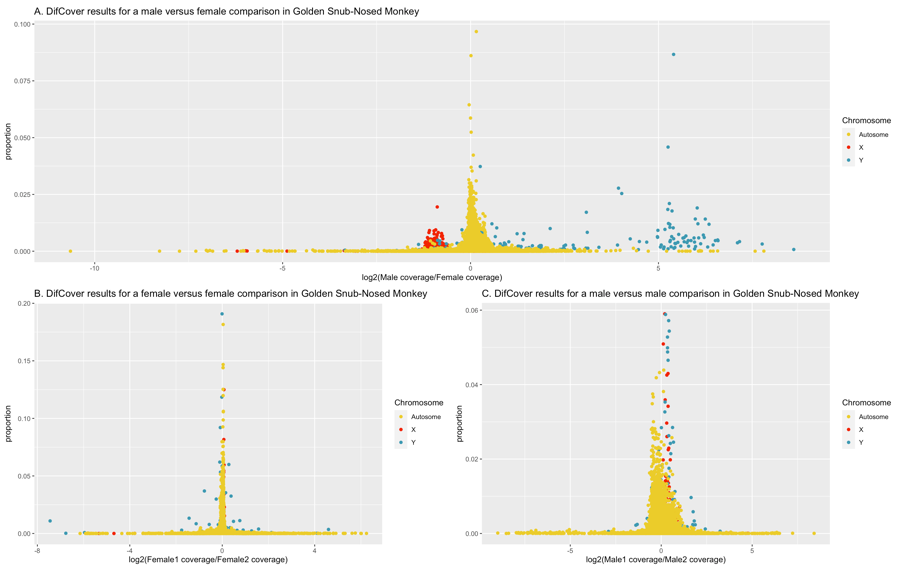

=================
Supplemental Text
=================

This page contains two sections that were not included in the SexFindR manuscript or supplements, but could be of use for others.

1. Genetic Sexing of the Tiger Pufferfish (fugu)
------------------------------------------------

In the tiger pufferfish (*Takifugu rubripes*), it had been previously shown that a single polymorphic site within the Amhr2 gene is consistently C/C in females and C/G in males (Kamiya et al. 2012). This SNP (NC_042303.1:12708100, hereafter referred to as fugu SDR) is reportedly the only fixed genomic difference between males and females of this species and is believed to be involved in sex determination. Recently, a group studying the evolution of salinity tolerance within the pufferfish clade, released a dataset containing whole-genome re-sequencing data for 29 tiger pufferfish (Zhang et al. 2020). Although these samples were deposited onto NCBI without phenotypic sex data, the strong support for the fugu SDR allowed us to genetically sex most of the samples using the following methods and criteria.  The tiger pufferfish samples (table S4) were downloaded from NCBI SRA repository using fasterq-dump and mapped to the reference genome, fTakRub1.2 (https://www.ncbi.nlm.nih.gov/genome/63), using Bowtie2. The fugu SDR and surrounding alignment was pulled from the resulting BAM files and viewed in IGV. Of the 29 samples, 13 displayed C/C genotypes for all of their reads and were classified as females for subsequent analyses. Of the remaining 16 samples, given the expected 50/50 ratio of G:C for males, samples with an excess of C or an excess of G were removed from the analysis. To this end, we classified samples as males if at least 25% of their reads were G and at least 25% of their reads were C. This resulted in confident identification of 14 males and the exclusion of 2 samples; one which had 87% G-containing reads and one that had 10% G-containing reads. No other bases were reported at the fugu SDR in any of these samples, suggesting that sequencing errors within this region were minimal for these data. The genetically-assigned sexes are found in table S5.

Although there are numerous studies that demonstrate a perfect correlation between genetic and phenotypic sex through the fugu SDR in the tiger pufferfish (Kamiya et al. 2012; Matsunaga et al. 2014), there is at least one reported population from an aquaculture center where the gonads (testis or ovary) did not agree with the fugu SDR (Matsunaga et al. 2014). The purpose of the tiger pufferfish in our study is to determine whether the methods we employ are capable of identifying fixed differences between males and females, even in a very young sex determination system where a single SNP could govern phenotypic sex.  Given this purpose, it is somewhat irrelevant whether the specific fugu samples downloaded from NCBI would have also followed a perfect correlation between genetic and phenotypic sex. We are primarily using these data to validate our ability to identify sex specific sequences as small as a single SNP to examine this possibility in sea lamprey. Although we could have generated simulated data for the same purpose, the fugu data is particularly valuable given that it represents true biological data from a living species.

2. The Value and Utility of kmersGWAS
-------------------------------------

As described in the main paper, k-mer based analyses have the potential to be incredibly powerful for uncovering sex-specific sequences.  Since k-mer based analyses do not rely on an assembled genome for read mapping, they side-step many of the issues associated with standard analyses.  One of the main reasons for carrying out coverage-based and population genomic analyses in Steps 1 and 2 of SexFindR is that the amount of divergence between an X and Y (or Z and W) will dictate the power of those different methods, and by only using one, you could easily miss an important signal.  Coverage methods are key if there is sufficient divergence to prevent reads from one sex chromosome from mapping to the other, whereas standard population genomics methods like FST and GWAS have power only when the reads from both sex chromosomes map equally well to the reference, so that the fixed differences between males and females can be identified.

With k-mer based methods, this boundary does not exist, because mapping is not required to identify the sex-specific sequence.  We already demonstrated that kmersGWAS was capable of identifying fixed differences in homomorphic systems (poplar and fugu), but we did not look at a system where coverage-alone would be sufficient to identify the sex chromosomes.  To prove the utility of kmersGWAS across the divergence continuum, we downloaded re-sequencing data from the golden snub-nosed monkey (*Rhinopithecus roxellana*) which has the standard placental mammalian XY system with a degenerate Y chromosome (table S4).

Sex chromosomes were initially identified by running DifCover for the male reference (SRR1040959) used in genome assembly (Zhou et al. 2014) against individuals that had been previously re-sequenced and sexed (Yu et al. 2016; Kuang et al. 2019).  In the ASM756505v1 assembly, (GCA_007565055.1 on NCBI), the X chromosome is NC_044555.1 (chromosome 7) and the Y chromosome is NC_044570.1 (chromosome 22) given our results (fig. S9).  Sex of the remaining samples was confirmed by running samtools depth on 10kb of sequence selected from the X, the Y and an autosome (NC_044554.1).  Males were expected to display similar coverage between the X and Y, but twice that level of coverage on the autosome (i.e., 1X, 1Y, 2A).  Females were expected to show similar coverage between the X and autosome, but little-to-no coverage on the Y.  Sexed predicted using this method were compared to those that were previously published (Kuang et al. 2019), and samples that did not agree were discarded (table S11).

* Fig. S9. DifCover analysis of the golden snub-nosed monkey. Each plot shows log2(coverage difference) on the X axis and the proportion of the full chromosome that that specific region occupies on the Y. Only full chromosomes (not scaffolds) are analyzed. The X and Y chromosomes are highlighted in red and teal, respectively, and all autosomes are coloured in yellow.  A: male/female comparison with low male coverage on the X and high male coverage on the Y.  B and C: female/female and male/male comparison, respectively, with no significant differences between X and Y chromosomes between the individuals of the same sex. *

Once the sexing was completed, kmersGWAS was carried out using 12 males and 13 females.  The top p-value achieved in this analysis was 1.537e-12 which appeared for 1,688,851 k-mers that were fixed in males and absent in females.  These k-mers were assembled with ABYSS into 73,400 short contigs and blastn was used to map these contigs to the reference genome.  36,699 of these contigs found a position in the assembled genome using blastn, and this position was the Y chromosome for over 90% of the contigs (fig. S10).

.. image:: images/abyss_monkey.pnd

*Fig. S10. kmersGWAS identified the Y chromosome in golden snub-nosed monkey within the class of k-mers that produced the smallest p-value.  These male-specific k-mers map back to the Y chromosome almost exclusively.  *

Given this result, we have demonstrated that kmersGWAS is able to identify sex-specific across the entire divergence continuum, ranging from a single sex-specific SNP in fugu to a degenerate sex-specific Y chromosome in the golden snub-nosed monkey.  kmersGWAS is a fast and straightforward method that does not rely on a reference genome and it is quite powerful for the detection of sex chromosomes.  
