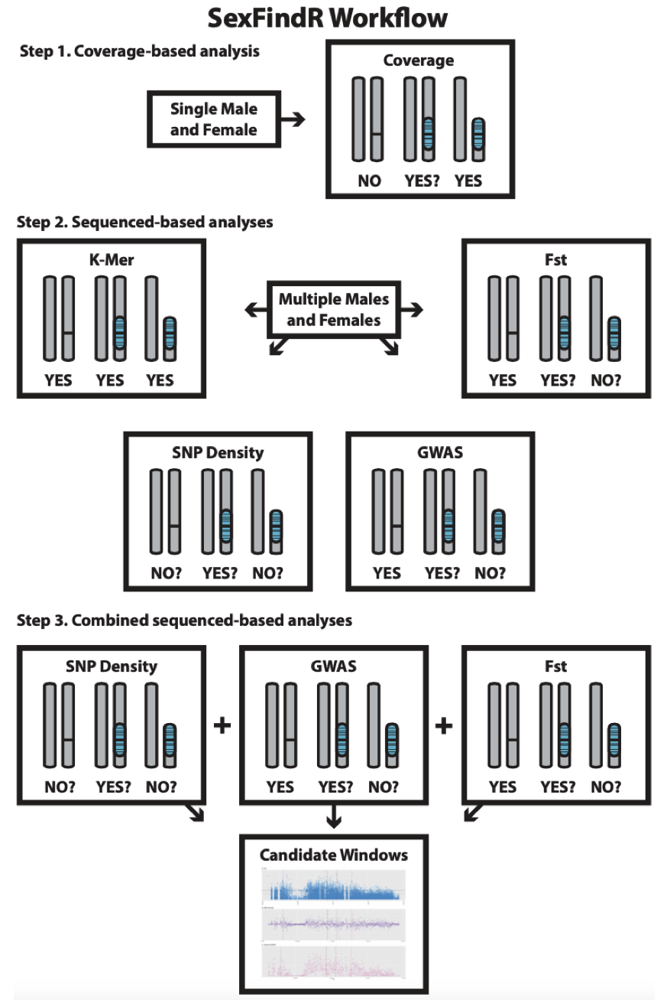

.. SexFindR documentation master file, created by
   sphinx-quickstart on Mon Nov  1 10:07:17 2021.
   You can adapt this file completely to your liking, but it should at least
   contain the root `toctree` directive.

SexFindR Workflow Overview
==========================

These pages contain the documentation necessary to run SexFindR on your species of interest. The pages are meant to used in conjunction with the folders on Github (https://github.com/phil-grayson/SexFindR), which contain the same structure. Commands for the analysis of tiger pufferfish (*Takifugu rubripes*) are present throughout to reproduce these analyses as a test case. When relevant, software versions and links to the source code are presented when the software is mentioned the first time.

Commands were run using a combination of SLURM systems and standard Linux servers. When possible, configurations are provided for the SLURM systems in ``.sh`` scripts (these are submitted with ``sbatch`` commands). Commands that finish quickly, or commands that could only be run locally, are simply provided as command line input. ``R`` code is also provided for relevant steps. File paths, module loads, SLURM accounts, etc. may need to be modified for your specific use case.

Please reach out to Dr. Phil Grayson (``phil.d.grayson <at> gmail.com``) or open a GitHub issue if you experience difficulty running any part of the ``SexFindR`` workflow.

*Figure 1. SexFindR workflow in three steps*

Contents
########

.. toctree::
   :hidden:

   self

.. toctree::
  :maxdepth: 1

  Step 0. Mapping and variant calling
  Step 1. Coverage-based analysis
  Step 2. Sequence-based analyses
  Step 3. Combined sequence-based analysis
  Supplemental Code
